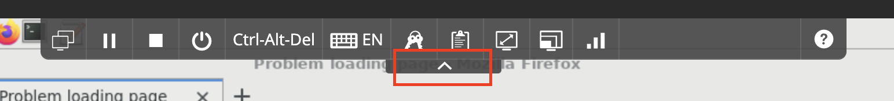
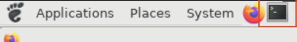
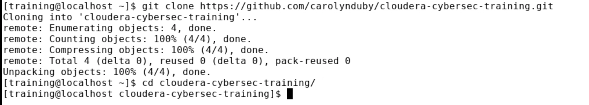

# Getting started with Cloudera cybersec
## Objectives
### Prepare the cluster for rest of the labs
1. Open Chrome or another browser and navigate to the url for your cluster.
2. Hide the VM toolbar by clicking the up arrow at the top of the VM screen.

3. Click the terminal icon. The terminal opens.

4. Select the commands below and copy them from your browser.  Move the mouse to the terminal window. 
Right click and select Paste to paste the commands below in the terminal window.

```shell script
git clone https://github.com/carolynduby/cloudera-cybersec-training.git
cd cloudera-cybersec-training
```




