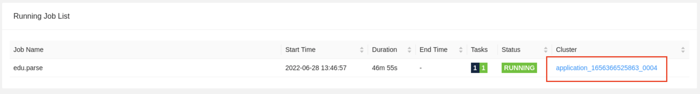

# Parse and normalize squid log format using a Grok parser.
## Objectives
* Configure a parser.
* View the output of the parser.
* Observe error handling.
## Lab Instructions
* Open the terminal window
* Run the parser set up command
```
[training@localhost cybersec]$ ./setup_parse.sh 
```
* List the hdfs paths and verify that the paths below were created.  These paths store the original events and grok patterns.
```
[training@localhost cybersec]$ hdfs dfs -ls -R /user/training
drwxr-xr-x   - training supergroup          0 2022-06-28 11:26 /user/training/cybersec
drwxr-xr-x   - training supergroup          0 2022-06-28 11:26 /user/training/cybersec/data
drwxr-xr-x   - training supergroup          0 2022-06-28 11:26 /user/training/cybersec/data/original-source
drwxr-xr-x   - training supergroup          0 2022-06-28 11:26 /user/training/cybersec/patterns
-rw-r--r--   3 training supergroup        170 2022-06-28 11:26 /user/training/cybersec/patterns/squid
```
* The cybersec parser job has a configuration file called [parser.properties](../cybersec/configs/parser/parser.properties)  and a start script called [start_parser.sh](../cybersec/start_parser.sh). 
* The parser chains and topic map settings are the first two lines in the [parser.properties](../cybersec/configs/parser/parser.properties) file.
```
chain.file=configs/parser/chains/squid_only_chain.json
chain.topic.map.file=configs/parser/topic_maps/squid_only_map.json
```
* During development, you will use the parser chains UI as shown in the lectures.  For the purposes of this lab we will use prebuilt parser chains that were generated from the parser UI.
* Open the [squid_only_chain.json](../cybersec/configs/parser/chains/squid_only_chain.json)  The parser chain contains a single task of a grok parser.
* Open the [squid_only_map.json](../cybersec/configs/parser/topic_maps/squid_only_map.json)  The topic map defines the parser for the squid topic.
* Return to the terminal and run the command below to create the squid topic and publish an event to the squid topic:
```
[training@localhost cybersec]$ ./publish_sample.sh samples/squid_prime.txt squid
Publishing 'samples/squid_prime.txt' to topic 'squid'.  TODAY=1656451264 SRC_IP = 1.1.1.1
<output snipped>
>22/06/28 14:21:06 INFO clients.Metadata: [Producer clientId=console-producer] Cluster ID: HAWLcRW2SaeeW0F_sSFIwQ
>22/06/28 14:21:06 INFO producer.KafkaProducer: [Producer clientId=console-producer] Closing the Kafka producer with timeoutMillis = 9223372036854775807 ms.
```
* Check that the topic exists by opening Streams Messaging Manager.
* Select the topic icon on the left side of the screen.

* Click refresh on the browser to see new topics.
* Enter squid in the search field.  The squid topic appears in the list of topics.  If you don't see it, wait a minute and click refresh again.
* Click on the Profile icon (second from the right).  
* SMM displays the events currently in the squid topic.

* Return to the terminal and run:
```
start_parser.sh
```
You will see an error message similar to the one below.  This is a benign message that you can ignore.
```
Exception in thread "Thread-5" java.lang.IllegalStateException: Trying to access closed classloader. Please check if you store classloaders directly or indirectly in static fields. If the stacktrace suggests that the leak occurs in a third party library and cannot be fixed immediately, you can disable this check with the configuration 'classloader.check-leaked-classloader'.
	at org.apache.flink.runtime.execution.librarycache.FlinkUserCodeClassLoaders$SafetyNetWrapperClassLoader.ensureInner(FlinkUserCodeClassLoaders.java:164)
	at org.apache.flink.runtime.execution.librarycache.FlinkUserCodeClassLoaders$SafetyNetWrapperClassLoader.getResource(
```
* Open the Flink Dashboard and verify the edu.parse job is running.  If you don't see the list of running jobs in the dashboard click Running Jobs on the left side of the dashboard.

* Verify the status of the job is green (RUNNING).  If not, click on the container link for the job:

* The dashboard for the flink job opens.  Click Task Managers on the left side of the screen.

* Click on the container link.

* The container dashboard appears.  Click the Logs tab.

* In Streams Messaging Manager, browse to the edu.triage.input topic.   You should see a normalized squid message.  The messages are in Avro which is a binary format.  

* Select Avro from the Values drop down.  The message will display in JSON.

* Select the more detail link to open the entire message in a dialog box. 

* Return to the command line and list the original files to verify the parquet files are written to HDFS.
```
[training@localhost cybersec]$ hdfs dfs -ls /user/training/cybersec/data/original-source
Found 2 items
drwxr-xr-x   - training supergroup          0 2022-06-28 13:47 /user/training/cybersec/data/original-source/2022-06-28--13
drwxr-xr-x   - training supergroup          0 2022-06-28 14:21 /user/training/cybersec/data/original-source/2022-06-28--14
[training@localhost cybersec]$ hdfs dfs -ls /user/training/cybersec/data/original-source/2022-06-28--13
Found 1 items
-rw-r--r--   3 training supergroup       1933 2022-06-28 13:47 /user/training/cybersec/data/original-source/2022-06-28--13/logs-0-0.parquet
```
* Publish a message that squid does not recognize.  
```
[training@localhost cybersec]$ ./publish_sample.sh samples/squid_error.txt squid
Publishing 'samples/squid_error.txt' to topic 'squid'.  TODAY=1656456098 SRC_IP = 1.1.1.1
```
* In SMM browse to the edu.parser.error topic.  There should be one error message in the topic.
